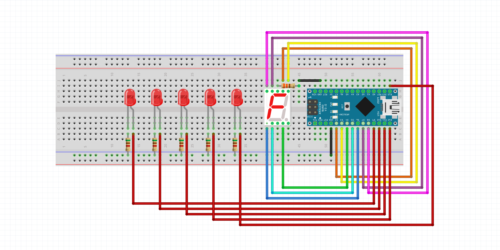
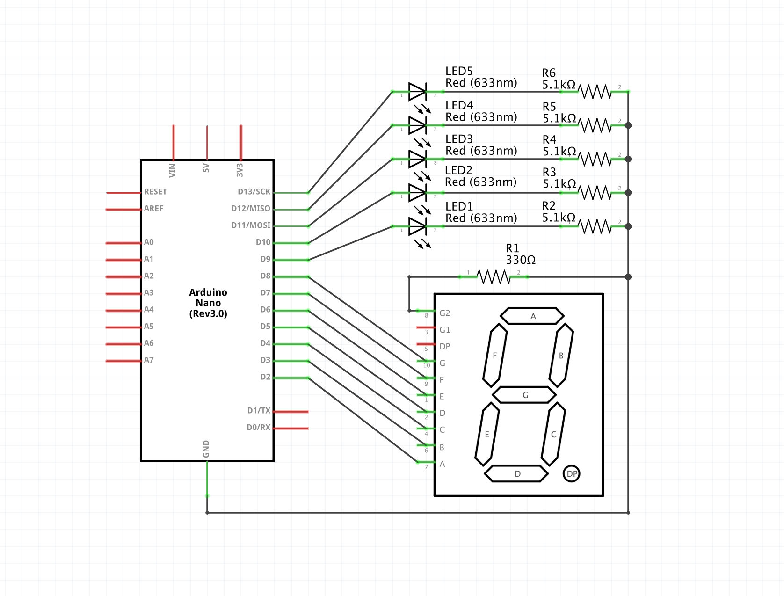

# simhub-simple-display

Basic Arduino-powered display for [SimHub](https://www.simhubdash.com/). Displays RPMs and current gear in real time*.

SimHub includes built-in support for certain Arduino display modules, but I wanted to make something out of hardware I already had lying around. This display uses a generic single-digit common cathode 7-segment display and some individual LEDs.


<small>\*The free version of SimHub has a 10Hz cap on the refresh rate of displays, but that should be enough for this one to update in basically real time. If you're having refresh rate issues with this display, don't be tempted to purchase the full version - troubleshoot elsewhere first.</small>

### Contents
- [Setup](#setup)
    - [Hardware](#hardware)
        - [Breadboard layout](#breadboard-layout)
        - [Circuit diagram](#circuit-diagram)
    - [Software](#software)
- [Configuration](#configuration)

## Setup

### Hardware

#### Breadboard layout

#### Circuit diagram



### Software
1. Navigate to your SimHub installation folder (typically `C:\Program Files (x86)\SimHub`) and into the `_Addons\Arduino\DisplayClientV2` directory.
1. Make a backup of `SHCustomProtocol.h`
1. Copy the two header files from this repo (located in `src`) into the `DisplayClientV2` directory. Make [configuration changes](#configuration) at this point if you wish.
1. Open `DisplayClientV2.ino` in your Arduino IDE, compile it, and upload it to your Arduino. SimHub needs to be closed during this step.
1. Launch SimHub.
1. Navigate to "Arduino" (on the left sidebar) and "My Hardware" (on the very right).
1. Select "multiple arduinos" - this is necessary to use the custom protocol feature according to the [SimHub Wiki](https://github.com/SHWotever/SimHub/wiki/Custom-Arduino-Hardware-Support), but this mode also works fine with a single Arduino.
1. In the settings pane below, find the "custom protocol" field and click the edit button. In the pop-up window, select "computed value" and paste in the following expression:
    ```
    format([GameRawData.Gear], '0') + ';' + format([Rpms], '0') + ';' + format([MaxRpm]-600, '0')
    ```
1. Close the window and click "Apply changes"
1. Launch one of the supported games and enjoy!

## Configuration
The following configuration options are supported and can be modified at the top of `SimpleDisplay.h`:
- Number of RPM LEDs (default: 5)
- Show startup animation (default: true)